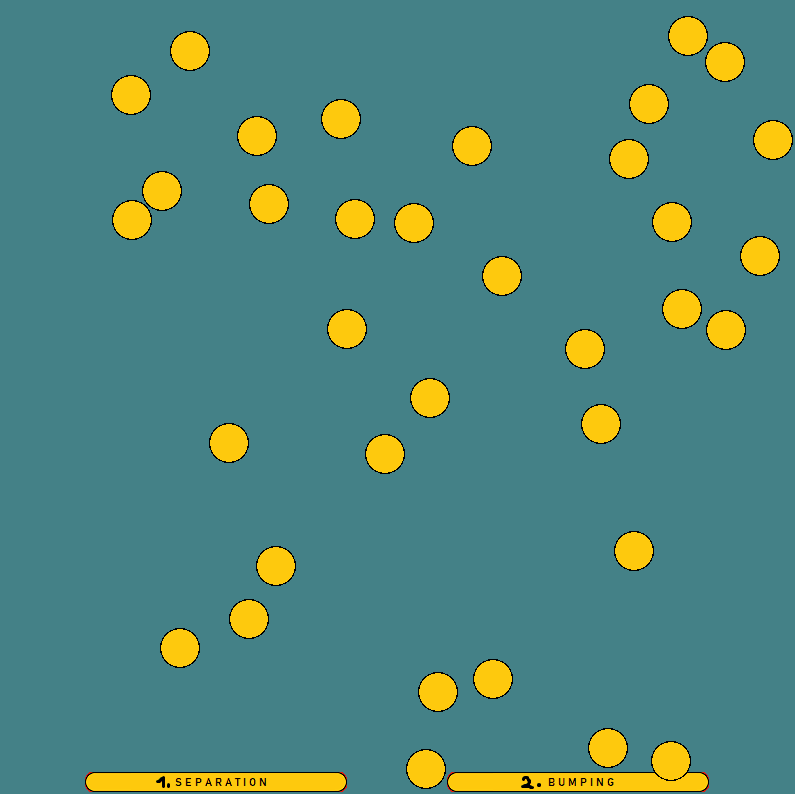

# 2D Collisions and bouncing
### Separation vector, bouncing, circular collision detection and resolution

1. there are `3` modes of this simple program
   1. (default) separation with bouncing
   2. just separation
   3. no collision detection (circles pass through each other)
2. input with the `keyboard`:
   1. `1` - switch the separation
   2. `2` - switch the bouncing (when separation is on)

###### tip: it's easier to notice the collision when focused on one circle