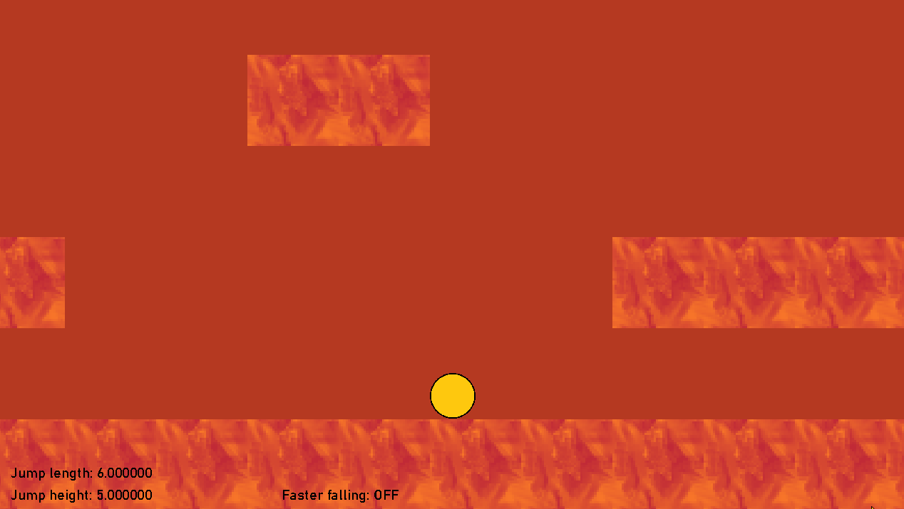

# Jumping playground
### Jump parameters, fast falling, collisions

1. **steering** - gamepad, being detected at runtime
2. during runtime you can change the following parameters of the jump:
   2. **jump length** - `i` key to increase, `k` to decrease
   3. **jump height** - `o` key to increase, `l` to decrease
3. you can also switch the _faster falling_ feature with the `g` key

