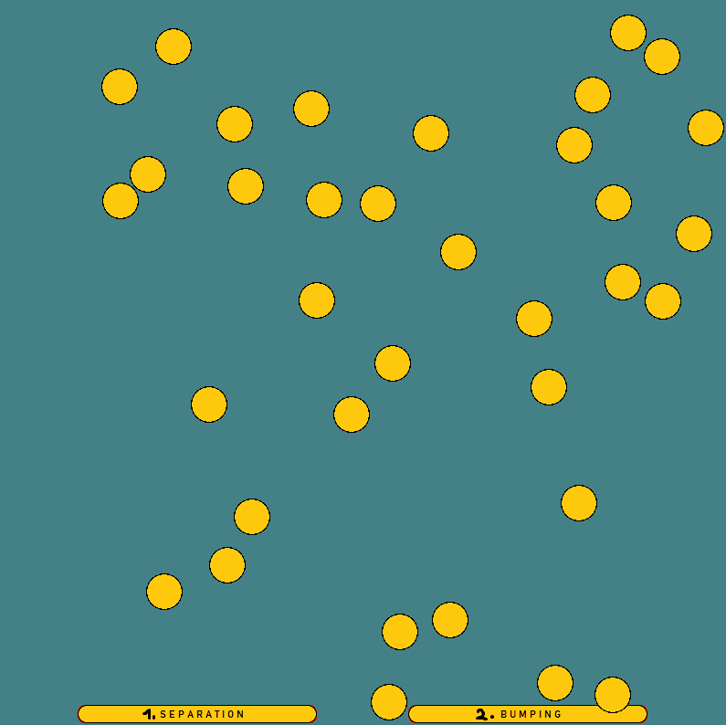

# 2D Game Programming

### Introduction
2D game programming project made with the [SDL2](https://www.libsdl.org/) library.  
Each subdirectory has a different project which was a separate university task that was 
being done during the course of one semester, implementing certain 2d mechanics. 

### Prerequisites
* [SDL2](https://www.libsdl.org/)
* [SDL_image](https://www.libsdl.org/projects/SDL_image/)
* [SDL_ttf](https://github.com/libsdl-org/SDL_ttf)

### Configuration
You can follow the tutorial on [LazyFoo's](https://lazyfoo.net/tutorials/SDL/index.php) 
website if you want to use **Visual Studio**. I prefer working with **Clion** and 
[this video](https://www.youtube.com/watch?v=7sIBklOTImI) was of great help
for me when setting everything up.

### Contents
1. 2D Camera with two players

2. 2D Collisions and bouncing

3. Jumping playground

4. Level map loading from .txt file

5. Paralax

6. Simple game - a race for the star

